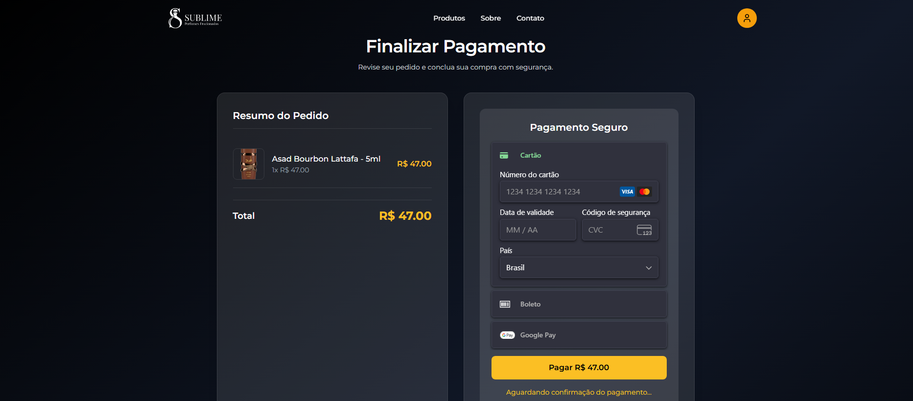
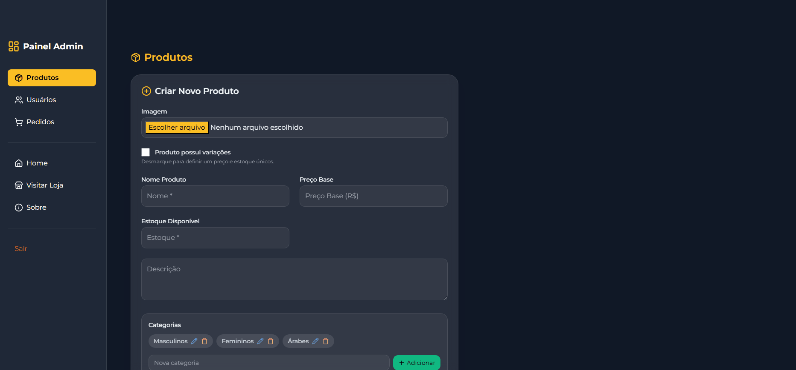

# 💎 E-commerce – Sublime Perfumes

## 🌐 Demonstração ao Vivo

🛒 **Acesse o projeto:** [sublimeperfumes.com.br](https://sublimeperfumes.com.br)

📱 Site 100% responsivo, desenvolvido pela [Digital Tricks](https://digitaltricks.com.br)  
💳 Integração completa com **Stripe** e painel administrativo em tempo real.

---

## 💼 Resumo do Projeto

O **E-commerce Sublime Perfumes** foi desenvolvido para oferecer uma experiência de compra moderna e fluida para uma marca de perfumes importados.  
O projeto inclui catálogo dinâmico, carrinho de compras, checkout com integração de pagamentos e um painel administrativo para controle de estoque e pedidos.

**Principais objetivos:**
- Criar uma plataforma elegante e intuitiva para aumentar as vendas online  
- Automatizar o processo de pedidos e pagamentos  
- Fornecer painel administrativo para o gestor acompanhar métricas e produtos  

**Resultado:**  
Um site completo, responsivo e otimizado, preparado para campanhas de marketing digital e SEO.

---

## 🖼️ Prévia do Projeto

| Home | Catálogo | Checkout | Painel Admin |
|------|-----------|-----------|--------------|
|  |  |  |  |

> *As imagens acima são demonstrativas do fluxo real de navegação e gerenciamento da loja.*

---

## ⚙️ Destaques Técnicos

- 🔐 Autenticação e autorização com **JWT**
- 🧩 API RESTful desenvolvida com **Spring Boot**
- 💳 Integração completa com **Stripe** (pagamentos reais)
- 🗄️ Banco **PostgreSQL** com **JPA/Hibernate**
- ⚙️ Containerização com **Docker Compose**
- 🖥️ Frontend moderno com **ReactJS + Tailwind CSS**
- 🚀 Deploy otimizado em servidor **Linux (NGINX + SSL)**
- 📦 Estrutura escalável para novos módulos (ex.: blog, automação de marketing)

---

## 🛠 Tecnologias


---

## 🌟 Funcionalidades

- Cadastro, login e gerenciamento de usuários  
- Painel administrativo completo  
- Catálogo dinâmico de perfumes importados  
- Carrinho de compras com atualização em tempo real  
- Processamento de pedidos e pagamentos via **Stripe**  
- Cálculo automático de frete  
- Integração com **PostgreSQL**  
- Interface moderna e responsiva (**React + Tailwind**)  

---

## ⚙️ Configuração e Execução

### 🔧 Variáveis de Ambiente

Crie um arquivo **.env** na raiz do projeto com as seguintes chaves:

```env
# Stripe
STRIPE_SECRET_KEY=sk_test_XXXXXX

# Banco de Dados (PostgreSQL)
SPRING_DATASOURCE_URL=jdbc:postgresql://localhost:5432/ecommerce
SPRING_DATASOURCE_USERNAME=postgres
SPRING_DATASOURCE_PASSWORD=senha

# Segurança
JWT_SECRET=umSegredoMuitoSeguro
```

---

### 🖥️ Backend (Spring Boot)

```bash
cd backend
mvn clean package
mvn spring-boot:run
```

O backend estará disponível em:  
➡️ **http://localhost:8080**

---

### 💻 Frontend (React)

```bash
cd frontend
npm install
npm run dev
```

O frontend abrirá em:  
➡️ **http://localhost:3000**

Para gerar o build de produção:

```bash
npm run build
```

---

## 🧠 Aprendizados e Desafios

Durante o desenvolvimento, alguns dos principais desafios enfrentados incluíram:

- 🔐 Configuração de **CORS** e autenticação **JWT** entre o backend e frontend  
- 🔄 Sincronização de estados entre o **React** e a **API REST**  
- 💳 Implementação **segura de pagamentos com Stripe**  
- 🚀 Deploy otimizado com **NGINX + SSL** em ambiente Linux  
- ⚡ Otimização de performance e build para produção  

Essas etapas fortaleceram minha experiência com **arquiteturas full stack modernas**, **integração segura de APIs** e **deploy em produção com Docker**.

---

## 🔐 Observações Importantes

⚠️ **Nunca exponha** a variável `STRIPE_SECRET_KEY` em repositórios públicos.  
⚙️ Revise suas configurações no `application.yml` ou `application.properties` antes do deploy.  
🌐 Ajuste o **CORS** para permitir apenas o domínio de produção:  
`https://sublimeperfumes.com.br`

---

## 🤝 Créditos

👨‍💻 **Desenvolvido por [Digital Tricks](https://digitaltricks.com.br)**  
🚀 Projeto real: [sublimeperfumes.com.br](https://sublimeperfumes.com.br)  

---

## 📄 Licença

Este projeto foi desenvolvido para **fins comerciais e de demonstração**.  
Qualquer reprodução, redistribuição ou uso sem autorização é **estritamente proibida**.

---

## 📬 Contato

📧 **E-mail:** contato@digitaltricks.com.br  
🌐 **Site:** [digitaltricks.com.br](https://digitaltricks.com.br)  
📱 **WhatsApp:** +55 (85) 92174-3200 

💼 **Digital Tricks – Transformando ideias em experiências digitais.**
# Restaurante
