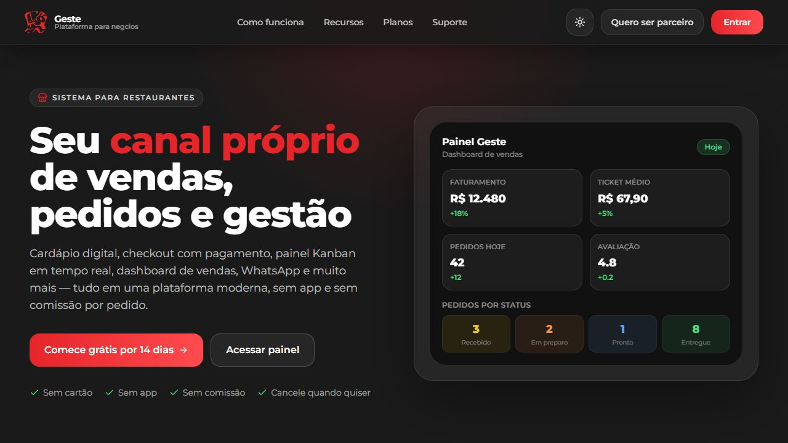
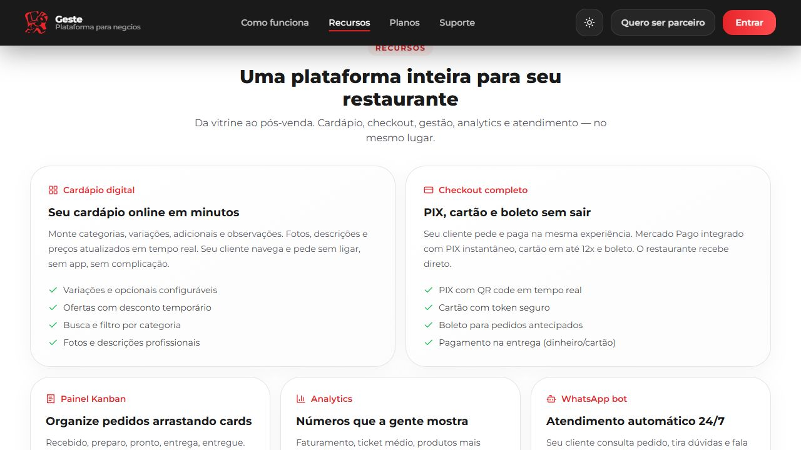

# Digital Tricks Restaurantes

Plataforma full-stack para restaurantes com cardapio digital, checkout, painel operacional, pagamentos e programa de fidelidade.

Este projeto esta sendo preparado para uso open source. A base atual ja cobre fluxo de cliente, operacao do restaurante e integracoes de pagamento, mas ainda existem areas em consolidacao, especialmente testes automatizados e partes do dashboard de fidelidade.

## Interface

### Página inicial



### Recursos da plataforma



## Visao Geral

O sistema foi pensado para operar o ciclo completo de um restaurante digital:

- vitrine publica por restaurante
- cardapio com categorias, variacoes e opcionais
- carrinho guest e logado
- checkout com PIX, cartao e pagamento na entrega
- painel administrativo com pedidos em tempo real
- gestao de produtos, cupons, clientes e equipe
- fidelidade com niveis, recompensas e resgate por pontos

## Para Quem Este Projeto E

Este repositorio pode ser util para:

- desenvolvedores que querem uma base real de restaurante com frontend e backend separados
- freelancers e estudios que precisam acelerar um MVP ou produto white-label
- equipes que querem estudar fluxo de pedidos, checkout, dashboard operacional e fidelidade
- pessoas que procuram uma referencia pratica de integracao entre React, Spring Boot e Mercado Pago

Este projeto ainda nao e a melhor escolha para quem precisa:

- uma base pronta para producao sem adaptacoes
- cobertura alta de testes automatizados desde o primeiro dia
- arquitetura ja estabilizada para multi-tenant enterprise
- documentacao completa de deploy, observabilidade e operacao em escala

## O Que Ainda Falta Implementar Ou Consolidar

Antes de adotar o projeto como produto final ou base de cliente, vale considerar estes pontos:

### Funcionalidades ainda incompletas

- configuracao geral da fidelidade no dashboard ainda esta sendo consolidada
- estatisticas completas da fidelidade ainda precisam ser fechadas
- parte da experiencia publica da fidelidade ainda esta em refinamento
- gestao completa de entregadores ainda nao esta fechada
- atribuicao de entregador ao pedido ainda nao esta consolidada
- pedidos agendados ainda nao estao fechados
- relatorios exportaveis em PDF ou CSV ainda nao foram finalizados
- envio real de email para alguns fluxos ainda precisa de validacao completa
- rastreamento de entrega em tempo real ainda nao esta pronto
- refresh token e reautenticacao silenciosa ainda nao estao implementados
- rate limiting e protecoes anti-spam ainda precisam ser reforcados

### Maturidade tecnica ainda em aberto

- suite de testes do backend ainda e pequena para o tamanho do sistema
- ambiente de teste ainda depende de melhor tratamento para `JWT_SECRET`
- alguns servicos centrais concentram responsabilidades demais
- o build do frontend ainda apresenta warnings de bundle e assets
- a documentacao tecnica ainda esta em evolucao

## Aviso Para Quem Pretende Usar Em Producao

Se voce quer usar este projeto em operacao real, trate a base atual como um ponto de partida forte, nao como produto final plug-and-play.

Antes de publicar para clientes reais, o recomendado e:

1. revisar seguranca, segredos e politicas de acesso
2. substituir configuracoes de desenvolvimento por infraestrutura de producao
3. ampliar testes de auth, pedidos, pagamentos e fidelidade
4. validar todas as integracoes com credenciais reais e ambientes controlados
5. revisar fluxo de erro, logs, observabilidade e backup

## Principais Funcionalidades

### Cliente

- cardapio publico por `slug`
- carrinho persistente
- checkout com multiplas formas de pagamento
- historico de pedidos
- painel do cliente
- enderecos com CEP e calculo de frete
- fidelidade e recompensas

### Operacao

- dashboard administrativo
- kanban de pedidos
- dashboard TV/cozinha
- notificacoes em tempo real
- gestao de produtos, categorias e opcionais
- gestao de equipe e clientes
- cupons e ofertas
- analytics basico

### Integracoes

- Mercado Pago
- Cloudinary
- ViaCEP
- geocoding por endereco
- WhatsApp / bot flow

## Stack

| Camada | Tecnologias |
| --- | --- |
| Frontend | React 18, Vite, Tailwind CSS |
| Backend | Java 21, Spring Boot 3.5 |
| Banco | H2 no desenvolvimento, PostgreSQL suportado |
| Auth | JWT + Spring Security |
| Tempo real | WebSocket, STOMP, SockJS |
| Pagamentos | Mercado Pago |

## Estrutura do Repositorio

```text
Digital Tricks - Restaurantes/
|-- frontend/      # Aplicacao React + Vite
|-- restaurante/   # API Spring Boot
|-- docs/          # Diagramas, mapas e documentacao auxiliar
`-- README.md
```

## Modulos Principais

### Backend

- `admin/`: empresa, usuarios, dashboard e operacao
- `customer/`: autenticacao, perfil, enderecos e fidelidade do cliente
- `product/`: catalogo, categorias, opcionais e promocoes
- `order/`: pedidos, pagamentos, cupons, analytics e status
- `cart/`: carrinho guest/logado
- `bot/`: integracao de mensagens
- `integration/`: servicos externos
- `shared/`: seguranca, validacao, exceptions e utilitarios
- `bootstrap/`: seed de dados iniciais

### Frontend

- `pages/`: telas principais
- `components/`: UI reutilizavel
- `context/`: auth, carrinho e notificacoes
- `hooks/`: hooks customizados
- `utils/`: ACL, services e helpers

## Como Rodar Localmente

### Requisitos

- Node.js 18+
- npm
- Java 21
- Maven Wrapper (`./mvnw` ja incluido)

### 1. Backend

Entre na pasta do backend:

```bash
cd restaurante
```

Defina ao menos a variavel obrigatoria abaixo:

```bash
JWT_SECRET=uma-chave-base64-ou-chave-longa-segura
```

Variaveis opcionais, dependendo do que voce quer testar:

```bash
MP_ACCESS_TOKEN=
CLOUDINARY_CLOUD_NAME=
CLOUDINARY_API_KEY=
CLOUDINARY_API_SECRET=
MAIL_USERNAME=
MAIL_PASSWORD=
WHATSAPP_VERIFY_TOKEN=
DB_URL=
DB_DRIVER=
DB_USERNAME=
DB_PASSWORD=
CORS_ALLOWED_ORIGINS=
SERVER_PORT=
```

Por padrao, o projeto sobe com H2 em memoria:

```bash
./mvnw spring-boot:run
```

API local: `http://localhost:8080`

### 2. Frontend

Entre na pasta do frontend:

```bash
cd frontend
npm install
```

Opcionalmente, configure variaveis do Vite:

```bash
VITE_API_URL=http://localhost:8080
VITE_MERCADO_PAGO_PUBLIC_KEY=
```

Suba o ambiente de desenvolvimento:

```bash
npm run dev
```

Frontend local: `http://localhost:5173`

## Scripts Uteis

### Backend

```bash
./mvnw spring-boot:run
./mvnw -q -DskipTests compile
./mvnw test
```

### Frontend

```bash
npm run dev
npm run build
npm run preview
```

## Estado Atual do Projeto

O projeto ja esta utilizavel como produto, mas ainda nao esta totalmente consolidado como base open source.

### Ja funciona bem

- fluxo principal de cardapio, carrinho e pedido
- painel administrativo de operacao
- integracao principal com Mercado Pago
- autenticacao de cliente e equipe
- fidelidade com niveis, recompensas e resgate em evolucao real

### Pontos que ainda precisam de maturacao

- testes automatizados do backend ainda sao fracos
- `JWT_SECRET` ainda precisa de melhor tratamento para ambiente de teste
- parte da configuracao de fidelidade no admin ainda esta sendo consolidada
- build do frontend ainda tem warnings de bundle grande e alguns assets

## Roadmap Curto

- fortalecer testes de backend
- fechar persistencia completa da fidelidade no dashboard
- reduzir acoplamento em servicos centrais de pedido
- melhorar performance do frontend
- ampliar a documentacao para contribuidores

## Contribuindo

Contribuicoes sao bem-vindas.

Se voce quiser colaborar:

1. abra uma issue descrevendo bug, ideia ou melhoria
2. alinhe o escopo antes de mudancas grandes
3. envie um pull request com contexto claro
4. prefira mudancas pequenas e bem isoladas

Ao contribuir:

- nao commite segredos
- mantenha compatibilidade com o fluxo principal do restaurante
- documente comportamento novo ou mudanca relevante
- inclua testes quando fizer sentido

## Observacoes Importantes

- o projeto usa JWT em `localStorage` no frontend atual
- algumas integracoes dependem de credenciais reais para serem exercitadas por completo
- o ambiente local pode rodar com H2, mas producao deve usar banco persistente

## Open Source Checklist

Antes da publicacao aberta, ainda vale fechar estes itens:

- revisar segredos, seeds e dados demo
- validar exemplos de ambiente em onboarding real
- fortalecer a suite minima de testes

## Licenca

Distribuido sob a licenca MIT. Veja [`LICENSE`](LICENSE).

## Referencias

- Mapa funcional: `docs/feature-map.excalidraw`
- Backend principal: `restaurante/`
- Frontend principal: `frontend/`
- Guia de contribuicao: `CONTRIBUTING.md`
- Exemplos de ambiente: `restaurante/.env.example` e `frontend/.env.example`
